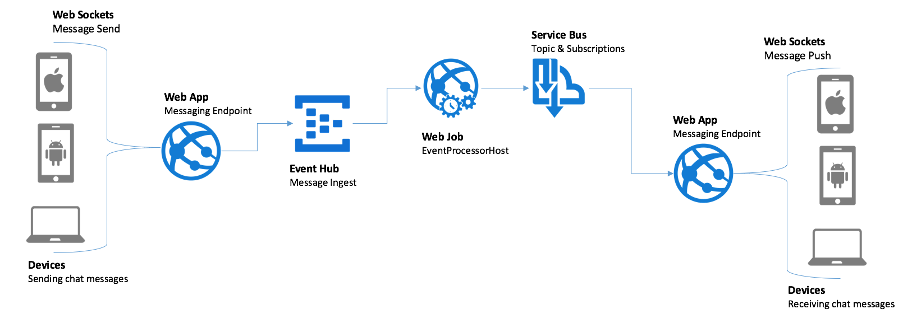
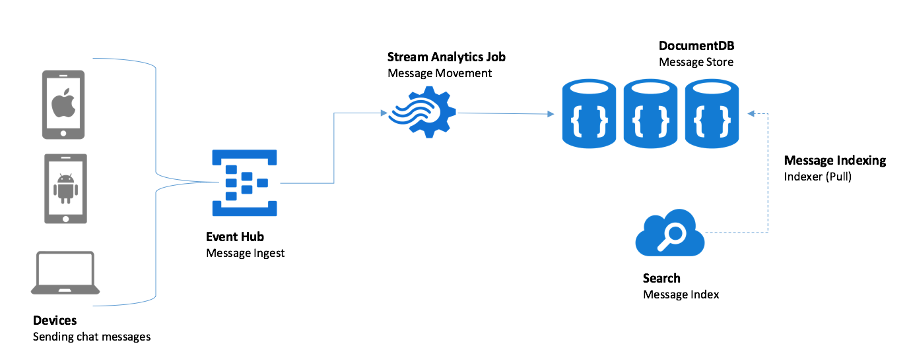

Summary
=======

Real-time chat is engrained into our expectations of everyday business communication. Applying sentiment analysis to the chat messages as the flow between users can help unlock actionable insights that would otherwise be require a human monitoring all chat conversations.

The Sentiment Analysis for Real-Time Chat Tutorial demonstrates the application of Microsoft Cognitive Services sentiment analysis as chat messages flow between web-based clients, enabling immediate visualization of sentiment in the chat clients and in Power BI dashboards that update in real time.

Description
===========

The tutorial uses several Azure services to power a real-time chat infrastructure that is readymade for analytics. Event Hubs ingest chat messages received from websites running in Web Apps. Web Jobs are used to pull chat messages from Event Hubs, invoke the Text Analytics API to apply sentiment scores to each message and to forward messages to Service Bus Topics from which chat participants receive their messages. Stream Analytics is used to drive the archival of scored chat messages into Document DB and Azure Search is used to make the stored chat messages full text searchable.

Prerequisites
=============

-   Visual Studio 2015 or later

-   Azure Subscription

-   Power BI Subscription

Next Steps
==========

1.  Download the sample Visual Studio 2015 Starter Project.

2.  Read the Tutorial Guide for step by step instructions on setting up the Azure environment and creating the Power BI dashboard.

3.  Invite a few peers to chat with you using your deployed solution and observe the sentiment applied in real-time.

4.  Optionally, read the Backgrounder document for information on the architecture and implementation that provides the real-time chat infrastructure.

Additional Reference
====================

-   Cognitive Services Text Analytics [API Reference](https://westus.dev.cognitive.microsoft.com/docs/services/TextAnalytics.V2.0)
