Tutorial: Sentiment Analysis for Real-Time Chat

Scenario
========

Adventure Works travel specializes in building software solutions for the hospitality industry. Their latest product is an enterprise mobile/social chat product called Concierge+. The mobile web app enables guests to easily stay in touch with the concierge and other guests, enabling greater personalization and improving their experience during their stay. Sentiment analysis is performed on top of chat messages as they occur, enabling hotel operators to keep tabs on guest sentiment in real-time.

Overview
========

The Tutorial consists of a single Visual Studio 2015 solution with three projects, as follows:

App Services:

-   ChatMessageSentimentProcessor: The Web Job that scores each message for sentiment, and forwards messages from the Event Hub to the Service Bus Topic for consumption by chat clients and to another Event Hub for message archival into Document DB.

-   ChatWebApp: The Web App that contains the web based user interface for chat and for message search.

-   ChatAPI: The API App that provides the access to the Azure Search index.

In order to be able to deploy and run the Tutorial you need to provision the Azure Services as illustrated in the diagram. Event Hubs ingest chat messages received from websites running in Web Apps. Web Jobs are used to pull chat messages from Event Hubs, invoke the Text Analytics API to apply sentiment scores to each message and to forward messages to Service Bus Topics from which chat participants receive their messages. Stream Analytics is used to drive the archival of scored chat messages into Document DB and Azure Search is used to make the stored chat messages full text searchable.

Pre-Requisites
==============

The requirements for building the solution are as follows:

-   Visual Studio 2015 Update 1 or later

-   Azure Subscription

-   Power BI Subscription

Environment Setup
=================

The following section walks you thru the manual steps to provision the services required using the portal.

Note: you will need to use both the Azure Portal (<https://portal.azure.com)> and the Manage Portal (<https://manage.windowsazure.com)> to completely provision all resources.

App Services
------------

In these steps you will provision two Web Apps and an API App within a single App Service Plan.

1.  Login to the Azure Portal.

2.  Click +NEW
    

3.  Select Web + Mobile
    

4.  Select Web App
    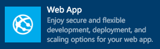

5.  On the Web App blade, provide an App Name that is indicative of this resource being used to host the Concierge+ chat website.

6.  Choose a Subscription

7.  Create new Resource Group that you will use for all resources (e.g. named “awchat”).

8.  Create a new App Service plan in a region near you, naming it as you desire. It should be set with a Pricing tier of S1 Standard.
    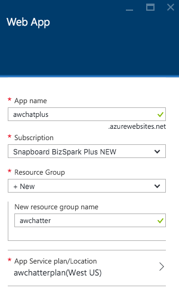

9.  Click Create. This will provision both the App Service Plan and the Web App.

10. When the provisioning completes, navigate to your new Web App in the portal.

11. On the Settings blade, click Application settings
    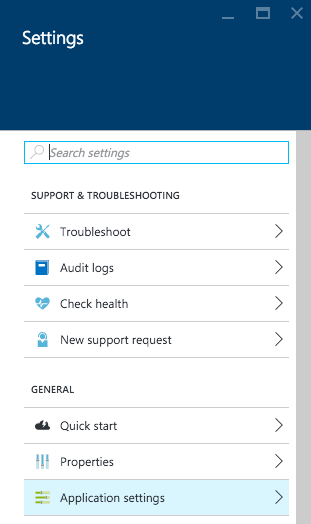

12. Click the toggle for Web Sockets to On.
    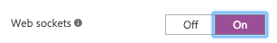

13. Click Save.
    

14. You are now ready to provision the other Web App using this same service plan.

15. Click +New, Web + Mobile, Web App.

16. Provide a name for this new Web App that indicates its use as the host for the Event Processor Web Job (e.g., ChatProcessorWebJob).

17. Choose the same subscription as used previously.

18. Choose the Resource Group that you created previously.

19. Choose the App Service plan that you created previously.
    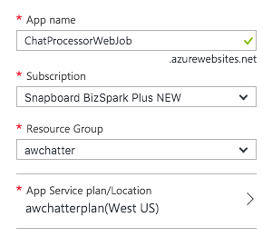

20. Click Create.

21. When the provisioning completes, navigate to your new Web App in the portal.

22. On the Settings blade, click Application settings
    

23. Set the Always On toggle to the On position. You want to make sure Always On is enabled for this so that the Web App hosting the Web Job never goes to sleep and is always processing chat messages.
    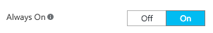

24. Click Save.
    

25. Select + New, Web + Mobile, API App.
    

26. Provide an App name for this API app that reflects it will host the Chat Search API (e.g., ChatSearchApi).

27. Choose the same subscription as used previously.

28. Choose the Resource Group that you created previously.

29. Choose the App Service plan that you created previously.
    

You now have all the App Services pre-created that you will need for this Tutorial.

Service Bus 
------------

In this section you will provision the Service Bus Namespace, Service Bus Topic and Event Hubs instance.

1.  Continuing within the Azure Portal, click + New.

2.  Select Hybrid Integration, then Service Bus. This will open the Manage Portal in a tab.
    

3.  In the New menu that appears, select Topic and then Custom Create.
    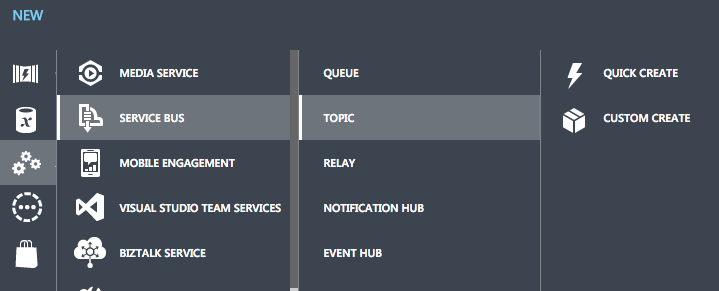

4.  In the Add a new topic dialog, provide a name for the topic (e.g., awhotel) that represents that this topic will handle the messages for a particular hotel.

5.  Choose the same region as you used for your App Services.

6.  For Namespace, select Create a new namespace.

7.  Provide a name for the namespace (e.g., awhotel-ns).
    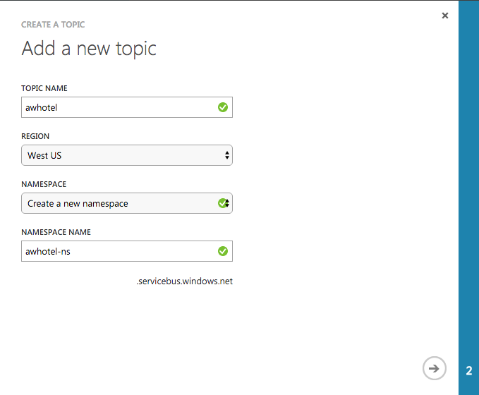

8.  Click the right arrow.

9.  Leave the Max Size at 1GB.

10. Set the Default Message Time To Live to 1 days.

11. Click the check mark to create the namespace and topic.

    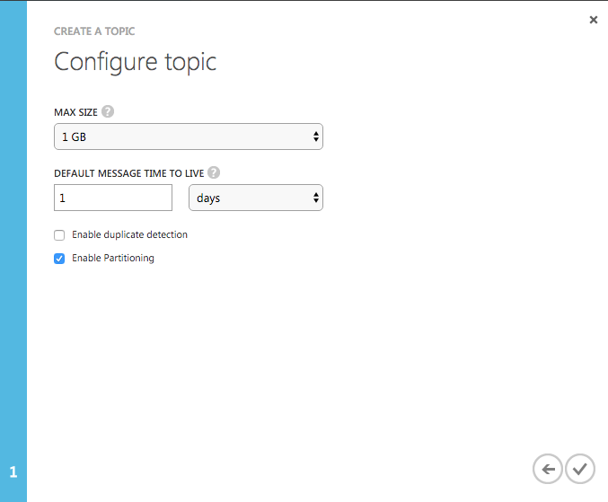

Event Hubs 
-----------

When the Namespace is ready, you will create an Event Hubs instance in it as well.

1.  Click the + New in the Manage Portal

2.  Select App Service, Service Bus, Event Hub and then Custom Create.

3.  Provide a name for the Event Hub.

4.  Choose the same region as you used for your App Services.

5.  Choose the namespace you previously created.

6.  Click the right arrow.
    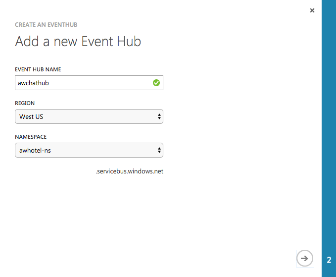

7.  Set the partition count to the max value of 32. This will enable you to significantly scale up the number of down stream processors on the Event Hub, where each partition consumer (as handled by the EventProcessorHost) can reach up to 1 Throughput Unit per partition should the need arise. You cannot change this value later.

8.  Set the Message Retention to 1 day.
    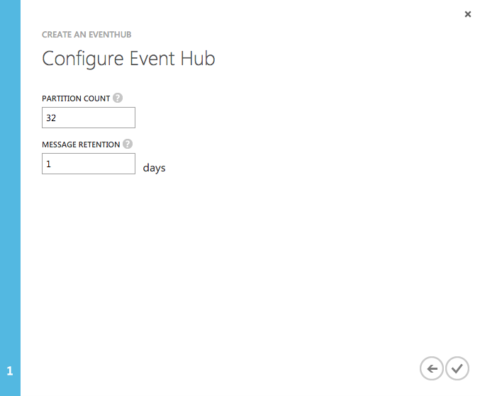

9.  Click the checkmark to create the Event Hub.

10. Click the Consumer Groups tab

11. Click + Create

12. Repeat steps 1-11 to create another Event Hub (this one will store messages for archival and be processed by Stream Analytics).

13. Name the Consumer Group ASA01 (it will be used by Azure Stream Analytics).

Document DB
-----------

In this section, you will provision a DocumentDB account, a DocumentDB Database and a DocumentDB collection that will be used to collect all of the chat messages.

1.  Return the Azure Portal (<https://portal.azure.com)>

2.  Select + New, Data + Storage, Azure DocumentDB.
    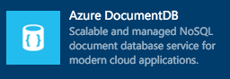

3.  Provide a unique name for the Document DB account.

4.  Choose the same subscription you have been using thus far.

5.  Choose the same Resource Group as you have used previously.

6.  Choose the same Location as you have for your other resources.
    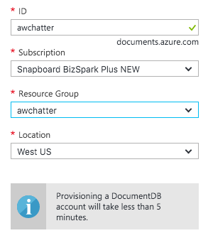

7.  Click Create.

8.  Once the Document DB account is ready, select Browse, Document DB Accounts and choose your Document DB account from the list.

9.  On the DocumentDB account blade, select Add Database

10. Provide an ID for the database (e.g., awhotels) and click OK
    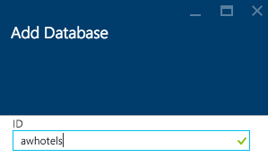

11. Click on your newly added database in the Databases tile
    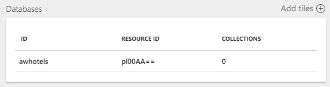

12. Click Add Collection
    

13. Provide a collection ID (e.g., messagestore)

14. Leave the Pricing Tier at Standard, the Partitioning Mode at Single Partition and the Throughput at 1000.
    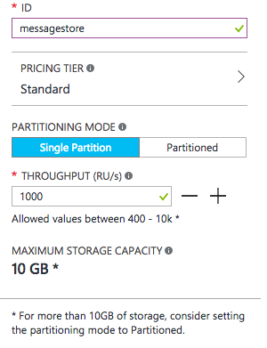

15. Click OK

Azure Search
------------

In this section you will create an Azure Search instance.

1.  Select + New, Data + Storage, Azure Search.

2.  Provide a URL for the search service.

3.  Choose the Subscription, Resource Group and Location as you have done for the previous services.

4.  Set the Pricing tier to Basic.
    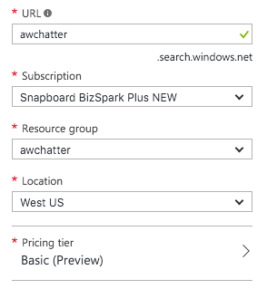

5.  Click Create

Stream Analytics
----------------

In this section, you will create the Stream Analytics Job that will be used to read chat messages from the Event Hub and write them to Document DB.

1.  Return to the Manage Portal.

2.  Click + New, Select Data Services, Stream Analytics, Quick Create
    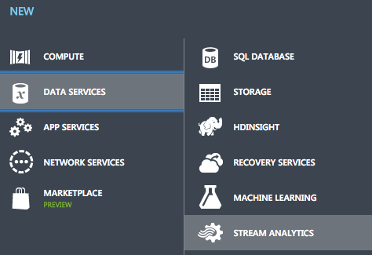

3.  Provide a Job Name (e.g., MessageLogger)

4.  Select the same region as you have used for the other services.

5.  Select a regional monitoring storage account.

6.  Click Create Stream Analytics Job.
    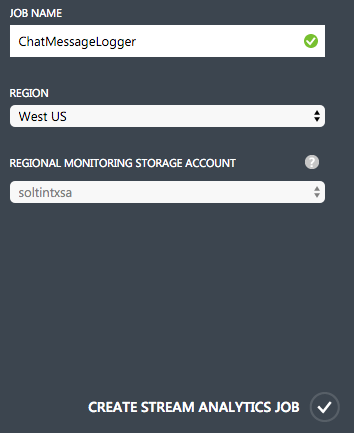

7.  When you Job is read, click on the name of your Stream Analytics job in the list.

8.  Click the Inputs tab
    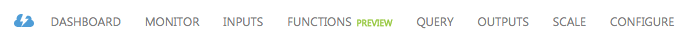

9.  Click add an Input
    

10. Choose Data Stream
    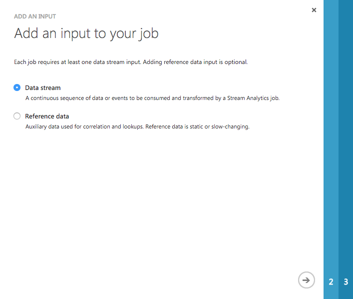

11. Click the right arrow

12. Select Event Hub
    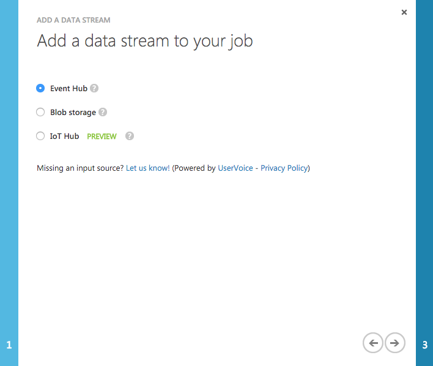

13. Click the right arrow

14. For the input alias, set the value to eventhub

15. Choose the Subscription which contains your Event Hubs instance

16. Choose the Namespace which contains your Event Hubs instance

17. Choose the second Event Hub instance you created and then be sure to choose the Consumer Group you had defined (e.g., ASA01)
    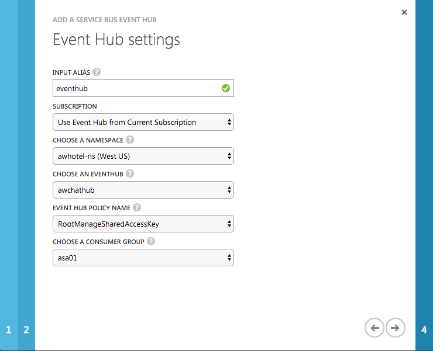

18. Click the right arrow

19. Leave the Serialization settings at JSON format and UTF 8 encoding
    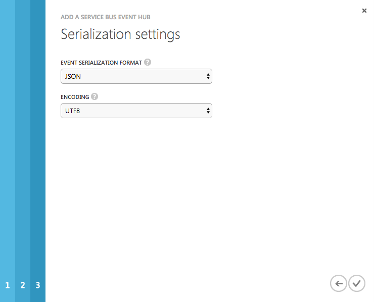

20. Click the checkmark

21. Click Outputs

22. Click Add an Output

23. Select DocumentDB

24. Click the right arrow

25. For the Output Alias, enter docdb

26. Leave Subscription set to Use Database Account from Current Subscription

27. Select your Document DB Account

28. Select your Document DB database

29. Set the Collection Name Pattern to the name of your single collection (e.g., messagestore)

30. Set the Partition Key to sessionid (be sure to enter it all lowercase).

31. Set the Document ID to messageid (again all lowercase).

32. Click the checkmark.
    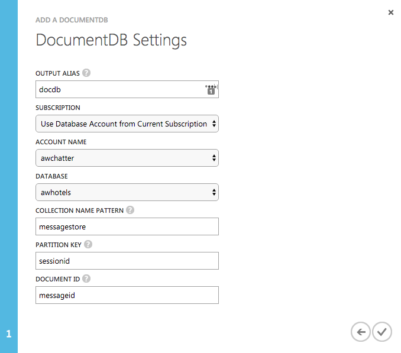

33. Click Query

34. In the query text box, enter the following query:

SELECT

\*

INTO

docdb

FROM

eventhub

1.  Click Save and Yes when prompted with the confirmation
    

Start the Stream Analytics Job
------------------------------

1.  Navigate in the Azure Portal to your Stream Analytics Job

2.  Click Start
    

3.  In the Start Output, leave the toggle to Job Start Time (the job will start processing messages from the current point in time onward).
    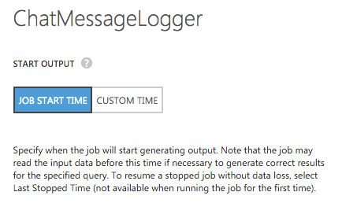

4.  Click the checkmark.

5.  Allow your Stream Analytics Job a few minutes to start

Storage Account
---------------

The EventProcessorHost requires an Azure Storage Account that it will use to manage its state amongst multiple instances. In this section you create that Storage Account.

1.  Using the Azure Portal, select + New, Data + Storage, Storage account

2.  Leave Resource Manager selected for the deployment model

3.  Click Create

4.  In the Create storage account blade, provide a unique name for the account

5.  Set the type to Standard LRS

6.  Choose your Subscription, Resource Group and Location to be consistent with the other resources you have created.
    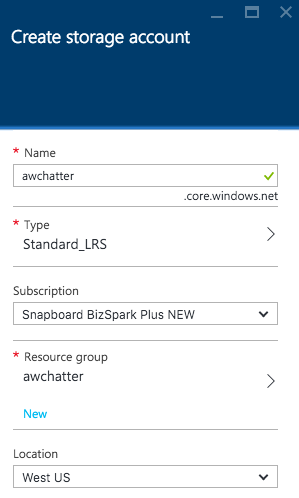

7.  Click Create

Text Analytics API
------------------

To provision access to the Text Analytics API (which provides sentiment analysis features), you will need to provision a Cognitive Services account.

1.  In the Azure Portal, click + NEW

2.  Select Data + Analytics

3.  Select Cognitive Services APIs
    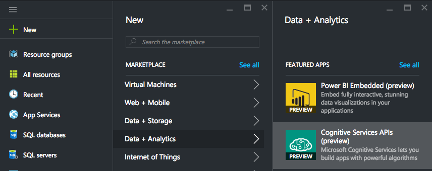

4.  Provide an Account Name

5.  Select API type and choose Text Analytics API

6.  For the Pricing tier, choose the Free tier and click Select.

7.  Choose an existing Resource Group (or create a new one as desired)

8.  Choose a Location near you

    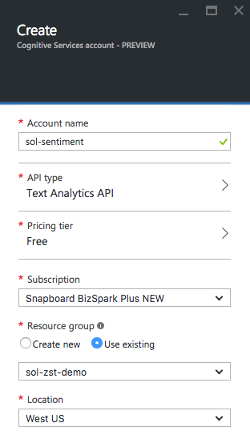

9.  Click Create to provision the Cognitive Services account

Configuring the App Services
============================

In this section you will configure the web based components, which consists of three parts: the Web App UI, a Web Job that runs the EventProcessorHost and and API App the provides a wrapper around the Search API.

Configure the Chat Message Processor Web Job
--------------------------------------------

Within Visual Studio Solution Explorer, expand the ChatMessageSentimentProcessor project and open App.Config. You will update the appSettings in this file, the following sections walk you thru the process of retrieving the values for the following settings:

&lt;add key="eventHubConnectionString" value="" /&gt;

&lt;add key="sourceEventHubName" value="" /&gt;

&lt;add key="destinationEventHubName" value="" /&gt;

&lt;add key="storageAccountName" value="" /&gt;

&lt;add key="storageAccountKey" value="" /&gt;

&lt;add key="chatTopicPath" value="" /&gt;

&lt;add key="textAnalyticsAccountName" value="" /&gt;

&lt;add key="textAnalyticsAccountKey" value="" /&gt;

### Event Hub Connection String 

The connection string required by the ChatMessageSentimentProcessor is different from the typical Event Hub consumer, because not only does it need Listen permissions, but it also needs Send and Manage permissions on the Service Bus Namespace (because it receives messages, as well as creates Subscriptions).

1.  To get the eventHubConnectionString, navigate to the *Namespace* that contains your Event Hub in the Manage Portal.

2.  Click the Configure tab
    

3.  In the Shared Access Policies, you are going to create a new policy that the ChatConsole can use to retrieve messages. For the New Policy Name, enter ChatConsole.

4.  In the list of Permissions, check Manage, Send and Listen.
    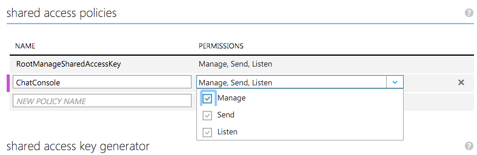

5.  Click Save

6.  Click the Cloud Icon

    

7.  Click Connection Information

    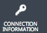

8.  In the dialog, hover over the connection string for your ChatConsole policy and click the copy button.
    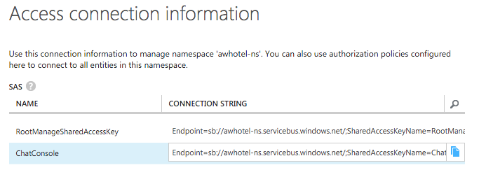

9.  Return to the app.config and paste this as the value for eventHubConnectionString.

### Event Hub Name

1.  For the sourceEventHubName setting in app.config, enter the name of your first Event Hub.

2.  For the destinationEventHubName, enter the name of your second Event Hub.

### Storage Account

1.  For the storageAccountName enter the name of the storage account you created.

2.  For the storageAccountKey enter the Key for the storage account you created (which you can from the Portal).

### Chat Topic 

1.  For the chatTopicPath, enter the name of the Service Bus Topic you had created.

### Text Analytics Settings

1.  Using the Azure Portal, from the Cogntive Service account blade for the account you created, click Keys.
    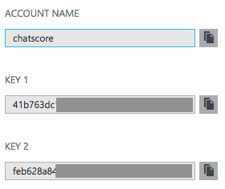

2.  Copy the value of Account Name into the value attribute of textAnalyticsAccountName in the app.config.

3.  Copy the value of Key 1 from the blade into the value attribute of the textAnalyticsAccountKey in the app.config.

Configure the Chat Web App
--------------------------

Within Visual Studio Solution Explorer, expand the ChatWebApp project and open Web.Config. You will update the appSettings in this file, the following sections walk you thru the process of retrieving the values for the following settings:

&lt;add key="eventHubConnectionString" value=" "/&gt;

&lt;add key="eventHubName" value=" "/&gt;

&lt;add key="chatRequestTopicPath" value=" "/&gt;

&lt;add key="chatTopicPath" value=" "/&gt;

### Event Hub Connection String 

1.  Use the same connection string you used for the eventHubConnectionString in the Web Job project.

### Event Hub Name

1.  For the eventHubName setting in app.config, enter the name of your first Event Hub, this event Hub will receive messages from the website chat clients.

### Chat Topic Path and Chat Request Topic Path

1.  For the chatTopicPath and chatRequestTopicPath, enter the name of the Service Bus Topic you had created. The value is the same for both settings in this case.

Deploying the App Services
==========================

With the App Services projects properly configured, you are now ready to deploy them to their pre-created services in Azure.

Publish the ChatMessageSentimentProcessor Web Job
-------------------------------------------------

1.  Within Visual Studio Solution Explorer, right click on the ChatMessageProcessor project and select Publish as Web Job.
    

2.  The Add Azure Web Job dialog should appear. Leave the WebJob run mode setting to Run Continuously and click OK.
    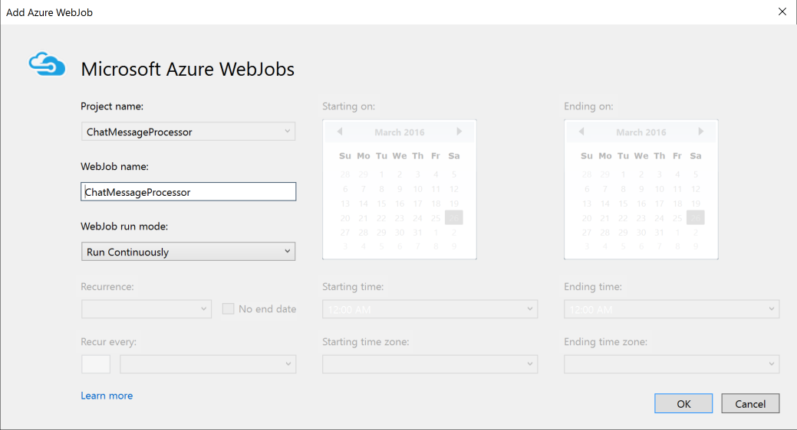

3.  In the Publish Web dialog, select Microsoft Azure App Service
    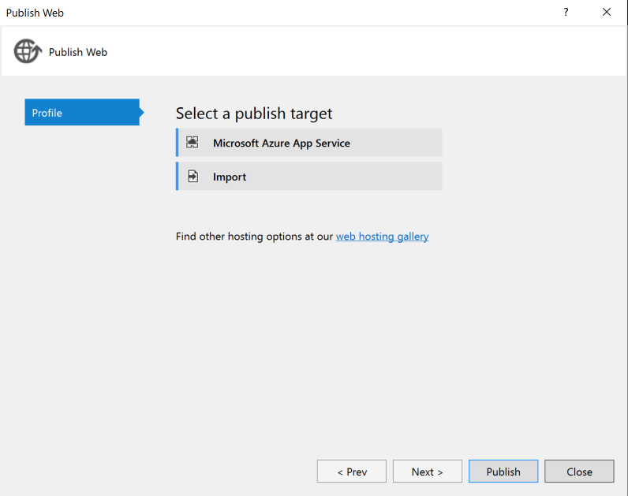

4.  In the App Service dialog, choose your Subscription that contains your Web Job Web App and in the Search box, type the name of your Web App (e.g. chatprocessor). The tree view below should display your Web App. Click on the node for your Web App in the tree view to select it.
    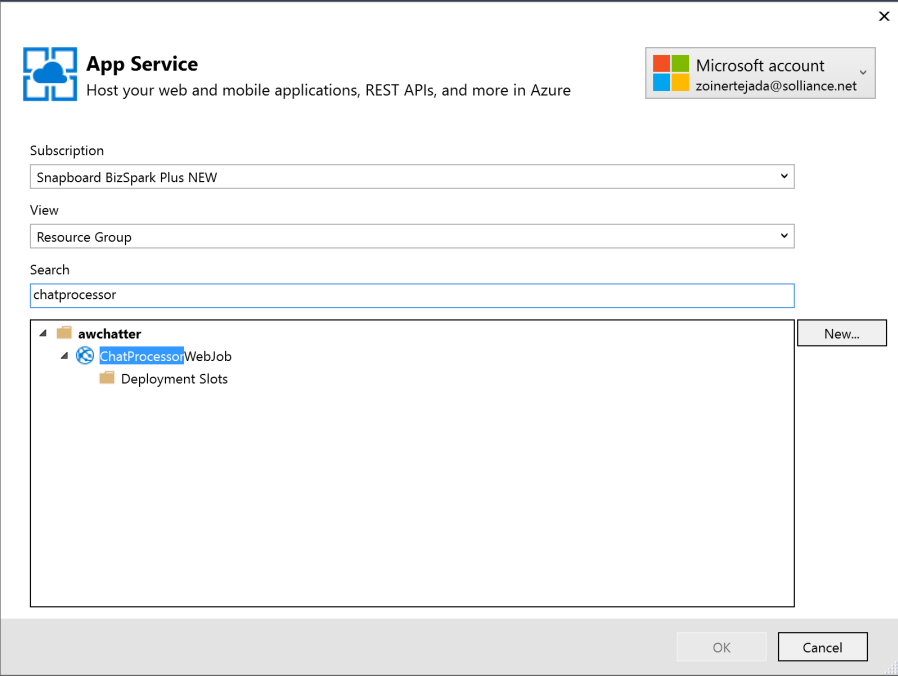

5.  Click OK
    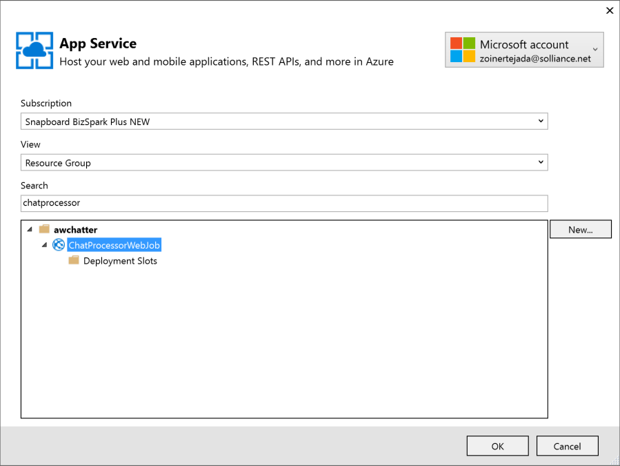

6.  Click Publish
    

7.  When the publis completes, the Output window should indicate success similar to the following:
    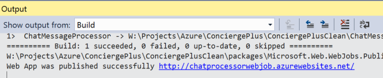

Publish the ChatWebApp
----------------------

1.  Within Visual Studio Solution Explorer, right click on the ChatWebApp project and select Publish.
    

2.  Select Microsoft Azure App Service
    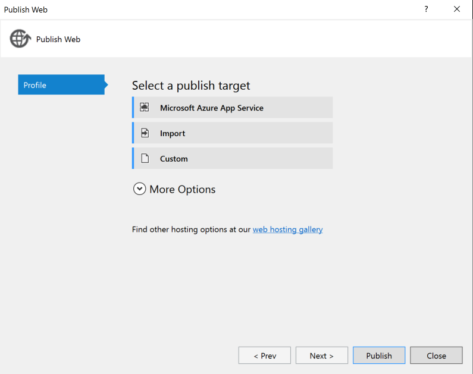

3.  If prompted, login with your credentials to your Azure Subscription

4.  In the App Service dialog, choose your Subscription that contains your Web App and in the Search box, type the name of your Web App (e.g. awchatplus). The tree view below should display your Web App. Click on the node for your Web App in the tree view to select it.
    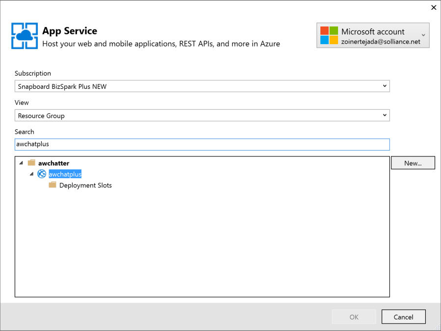

5.  Click OK.
    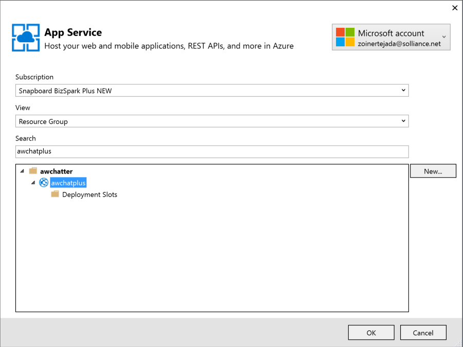

6.  Click Publish.
    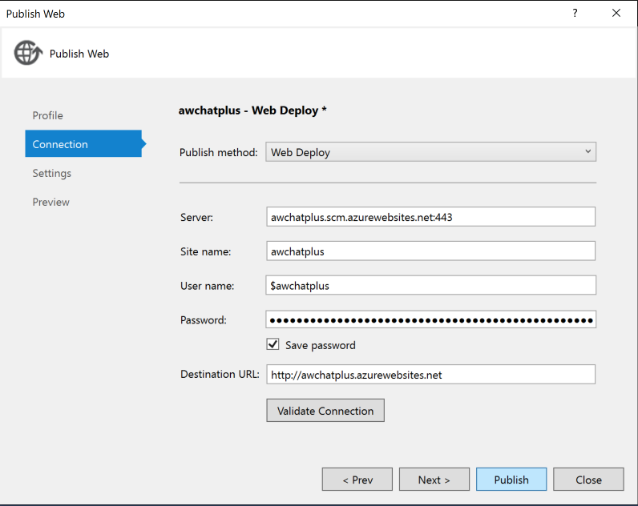

7.  When the publishing is complete, a browser window should appear with content similar to the following.
    

Testing out the Solution
========================

The Web App supports both the many-to-one hotel lobby chat and the one-to-one guest and concierge chat.

Testing Hotel Lobby Chat
------------------------

1.  Open a browser instance, and navigate to the deployment URL for your Web App.

2.  Under the Join Chat area, enter your username (anything will do).

3.  Leave Hotel Lobby selected.

4.  Click Join.
    

5.  The Live Chat should appear (notice it auto-announced you joining to the room, this is actually the first message).

    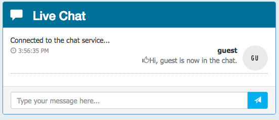

6.  Open another browser instance (you could try this from your mobile device).

7.  Enter another username and join.

8.  From either session, fill in the Chat text box and click send. You can try using @ and \# too, just to seed some text for search. Notice that the messages appear kind of like most chats. Notice that for each message a thumbs up or thumbs down icon is displayed next to the message- this is the sentiment indicator as computed using the Text Analytics API.

    

9.  You can join with as many sessions as you want (the Hotel Lobby is basically a public chat room).

Building the Power BI Dashboard
===============================

Now that you you have the solution deployed and exchanging messages, you can build a Power BI dashboard that monitors the sentiment of the messages being exchanged in real time. The following steps walk thru the creation of the dashboard.

1.  Login in to your Power BI subscription (<https://app.powerbi.com)>

2.  Under the Datasets list, looks for the dataset named as you had configured it in the Output for the Stream Analytics job, and click on that dataset.

3.  On the Visualizations palette, click Gauge to create a semi-circular gauge.
    

4.  In the Fields listing, click and drag the score field and drop it onto the Value field.
    

5.  Click the drop down that appears where you dropped score and select Average.
    

6.  You now should have a gauge that shows the average sentiment for all of the data collected so far, which should look similar to the following:
    

7.  Click Save to save your visualization to a new report.
    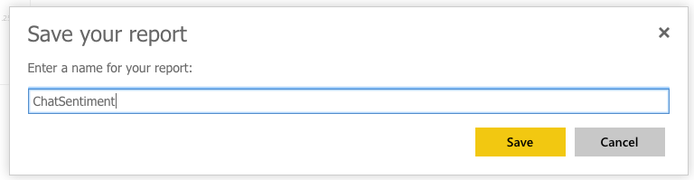

Creating the Real-Time Dashboard
--------------------------------

This gauge is currently a static visualization, we will use the report just created to seed a dashboard whose visualizations update as new messages arrive.

1.  Click the Pin icon located near the top right of the Gauge control.
    

2.  Select New dashboard, provide a name and click Pin.
    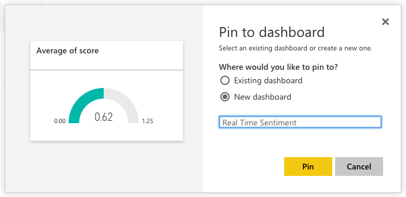

3.  In the list of dashboards, click on your newly created dashboard.
    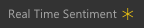

4.  Real-time dashboards are created in Power BI using the QA feature, by typing in a question to visualize in the space provided. In the “Ask a question about your data”, enter: “average score created between yesterday and today”.
    

5.  Next, convert this to a Gauge chart by expanding the Visualization palette at left, and selecting the Gauge control.

6.  Format the Gauge control so it ranges between 0.0 and 1.0 and has an indicator at 0.5. To do this, click the brush icon in the Visualization palette, expand Gauge axis and for Min enter 0, Max enter 1 and Target enter 0.5.
    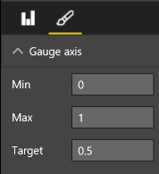

7.  Your gauge should now look similar to the following:
    

8.  In the top, right corner, click Pin Visual.
    

9.  In the dialog that appears select the dashboard you recently created and click Pin.
    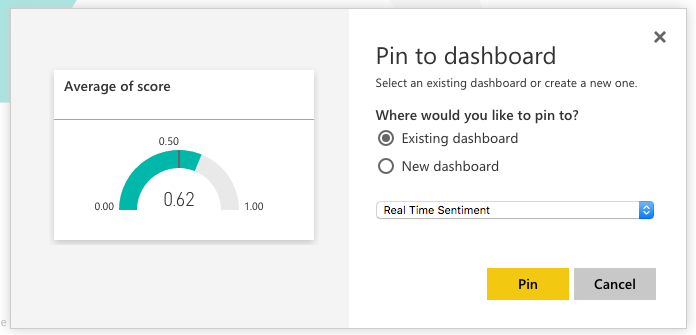

10. In the list of Dashboards, click on your dashboard. Your new, gauge should appear next to your original gauge. You can delete the original gauge if you prefer (click on the top of the visualization, then ellipses that appear and the trash can icon).
    

11. Navigate to the chat website you deployed and send some messages and observe how the sentiment gauge updates with moments of you sending chat messages.

12. Try building out the rest of the real-time dashboard that should look as follows. We provide the QA questions you can use below to get you started.
    

    1.  Count of Messages (Card visualization): count of messages between yesterday and today

    2.  Count of Messages by Username (Pie chart visualization): count of messages by username between yesterday and today

    3.  Upset Users (Bar chart visualization): Average score by username between yesterday and today

13. Invite some peers to chat and monitor the sentiment using your new, real-time dashboard.

Understanding the Sentiment Analysis Implementation
===================================================

It’s worth understanding how sentiment analysis is applied to messages as they flow thru the solution. Event Hubs ingest chat messages received from websites running in Web Apps. Web Jobs are used to pull chat messages from Event Hubs, invoke the Text Analytics API to apply sentiment scores to each message and to forward messages to Service Bus Topics from which chat participants receive their messages. Stream Analytics is used to drive the archival of scored chat messages into Document DB and Azure Search is used to make the stored chat messages full text searchable.

To understand how the Text Analytics API is invoked, within Visual Studio Solution Explorer, expand the ChatMessageSentimentProcessor project, and then open SentimentEventProcessor.cs. Within the file, navigate to ProcessEventsAsync, which represents the core processing performed by the Web Job.

In ProcessEventsAsync, we are provided an IEnumerable of EventData instances which contain the chat messages, in the form of EventData instances, that we are reading from the Event Hub partition. We iterate through this collection. For each message, we extract the binary payload from the EventData instance and the call GetSentimentScore (which wraps the call to the Text Analytics REST API). The resulting model, inclusive of sentiment score is packaged in a BrokeredMessage instance and then forwarded to the Service Bus Topic using TopicClient, for consumption by the web chat clients. Similarly, the binary serialized model is packaged in a new EventData instance and forwarded to the next Event Hubs instances for archival by Stream Analytics into Document DB.

async Task IEventProcessor.ProcessEventsAsync(PartitionContext context, IEnumerable&lt;EventData&gt; messages)

{

foreach (var eventData in messages)

{

try

{

var eventBytes = eventData.GetBytes();

var jsonMessage = Encoding.UTF8.GetString(eventBytes);

var msgObj = JsonConvert.DeserializeObject&lt;MessageType&gt;(jsonMessage);

msgObj.score = await GetSentimentScore(msgObj.message);

var updatedEventBytes = Encoding.UTF8.GetBytes(JsonConvert.SerializeObject(msgObj));

//Send to topic

BrokeredMessage chatMessage = new BrokeredMessage(updatedEventBytes);

EventData updatedEventData = new EventData(updatedEventBytes);

foreach (var prop in eventData.Properties)

{

chatMessage.Properties.Add(prop.Key, prop.Value);

updatedEventData.Properties.Add(prop.Key, prop.Value);

}

\_topicClient.Send(chatMessage);

//Send to next EventHub

\_eventHubClient.Send(updatedEventData);

}

catch (Exception ex)

{

LogError(ex.Message);

}

}

}

The implementation of GetSentimentScore is supported by a few internal classes which represent the payload sent (which is an array of documents to score, each having an id and body text), as well as methods that use the HttpClient to post the chat message text to the provisioned Cognitive Services API endpoint (passing the authentication token in the Ocp-Apim-Subscription-Key request headers).

class SentimentRequest

{

public SentimentDocument\[\] documents;

}

class SentimentDocument

{

public string id;

public string text;

}

private async Task&lt;double&gt; GetSentimentScore(string messageText)

{

double sentimentScore = -1;

using (var client = new HttpClient())

{

client.BaseAddress = new Uri(\_textAnalyticsBaseUrl);

client.DefaultRequestHeaders.Add("Ocp-Apim-Subscription-Key",
\_textAnalyticsAccountKey);

> client.DefaultRequestHeaders.Accept.Add(
> new MediaTypeWithQualityHeaderValue("application/json"));

var req = new SentimentRequest()

{

documents = new SentimentDocument\[\]

{

new SentimentDocument() { id = "1", text = messageText }

}

};

var jsonReq = JsonConvert.SerializeObject(req);

byte\[\] byteData = Encoding.UTF8.GetBytes(jsonReq);

// Detect sentiment

string uri = "sentiment";

var response = await CallEndpoint(client, uri, byteData);

var result = JsonConvert.DeserializeObject&lt;SentimentResponse&gt;(response);

sentimentScore = result.documents\[0\].score;

}

return sentimentScore;

}

static async Task&lt;String&gt; CallEndpoint(HttpClient client, string uri, byte\[\] byteData)

{

using (var content = new ByteArrayContent(byteData))

{

content.Headers.ContentType = new MediaTypeHeaderValue("application/json");

var response = await client.PostAsync(uri, content);

return await response.Content.ReadAsStringAsync();

}

}

Optional - Enabling Search Indexing
===================================

Now that you have primed the system with some messages, you will create a Search Index and an Indexer in Azure Search upon the messages that are collected in DocumentDB.

Verifying Messages Exist in Document DB
Before going further, a good thing to check is if messages are being written to Document DB from the Stream Analytics Job.

1.  In the Azure Portal, navigate to your Document DB account

2.  Click on your database

3.  Click on your collection

4.  Click Document Explorer
    

5.  If you see a list of document ID’s, you have some data to start with!
    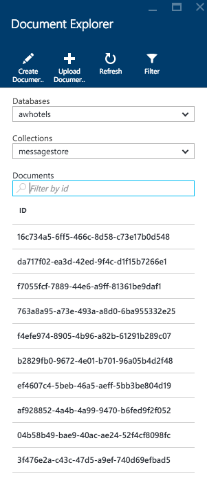

6.  If you want to peek at the message contents, click on any document in the listing.

    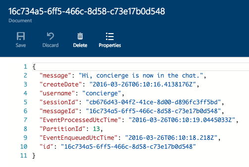

Creating the Index and Indexer
------------------------------

1.  Select Browse, Search services and choose your new Search instance from the list

2.  Click Import data
    

3.  On the Import data blade, click Connect to your data

4.  On the Data Source blade, select DocumentDB

5.  Provide a name for the data source (e.g., messagestore)

6.  Select your DocumentDB account

7.  Choose your DocumentDB database

8.  Choose your DocumentDB collection

9.  Click OK

10. Click Customize target index, observe that the field list has been pre-populated for you based on data in the collection.

11. Provide a name for the index (e.g., chatmessages)
    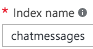

12. Leave the Key set to id
    

13. Check the Retrievable checkbox for the following fields: message, createDate and username (id will be checked automatically). Only these fields will be returned in query results.

14. Check the Filterable checkbox for createDate, username and sessionId. These fields can be used with the filter clause only (not used by this Tutorial, but useful to have).

15. Check the Sortable checkbox for createDate, username and sessionId. These fields can be used to sort the results of a query.

16. Check the Searchable checkbox for message. Only these fields are indexed for full text search.

17. Confirm your grid looks similar to the following.
    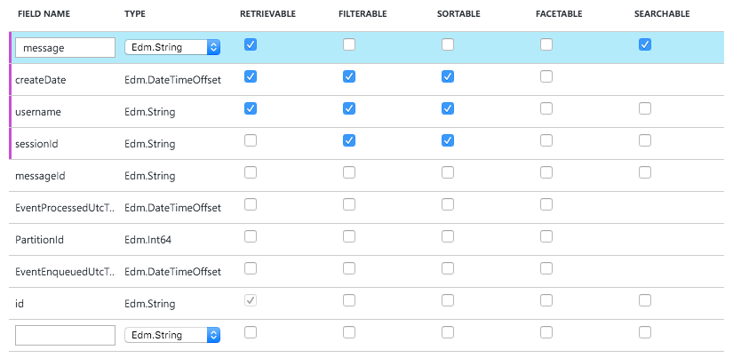

18. Click OK.

19. Click Import your data
    

20. On the Create an Indexer blade, provide a name.

21. Set the Schedule toggle to Custom

22. Enter an interval of 5 minutes (the minimum allowed)

23. Set the Start time to today’s date.
    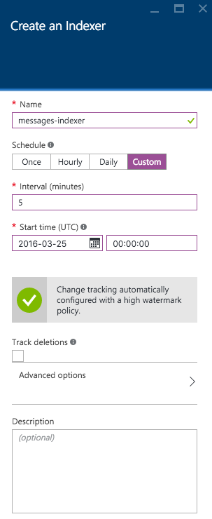

24. Click OK.

25. Click OK once more to begin importing data using your indexer.

26. After a few moments, examine the Indexers tile for the status of the Indexer.
    

Update the Web App’s web.config
-------------------------------

1.  Within Visual Studio Solution Explorer, expand the ChatWebApp project.

2.  Open Web.config

3.  For the chatSearchApiBase, enter the URI of the Search API App (e.g., http://awchatsearch.azurewebsites.net).
    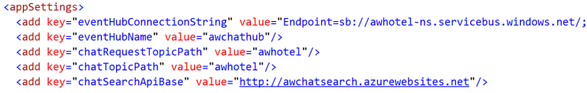

Configure the Search API App
----------------------------

1.  Within Visual Studio Solution Explorer, expand the ChatAPI project.

2.  Open web.config

3.  This project needs the following three settings configured in order to leverage Azure Search, all of which you can get from the Azure Portal.
    

4.  Using the Azure Portal, navigate to the blade of your Search service

5.  For the SearchServiceName, enter the name of your Search (e.g., awchatter).

6.  For the SearchServiceQueryApiKey, in the Portal, click the Key icon
    

7.  Click Manage Query Keys
    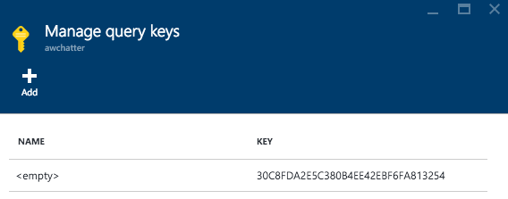

8.  Copy this value into the SearchServiceQueryApiKey setting.

9.  For the SearchIndexName setting enter the name of the Index you created in Search (e.g., chatmessages).

Publish the Updated ChatWebApp
------------------------------

Publish the updated ChatWebApp using Visual Studio, as was shown previously.

Publish the ChatAPI App
-----------------------

1.  Within Visual Studio Solution Explorer, right click on the ChatAPI project and select Publish.
    

2.  Select Microsoft Azure App Service
    

3.  If prompted, login with your credentials to your Azure Subscription

4.  In the App Service dialog, choose your Subscription that contains your API App and in the Search box, type the name of your API App (e.g. awchatsearch). The tree view below should display your API App. Click on the node for your API App in the tree view to select it.
    

5.  Click OK.
    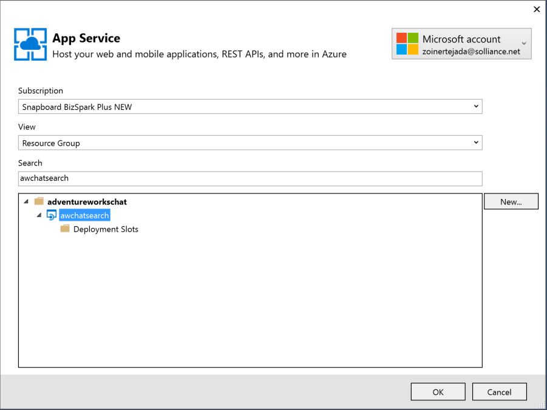

6.  Click Publish.
    

7.  When the publishing is complete, a browser window should appear with content similar to the following.
    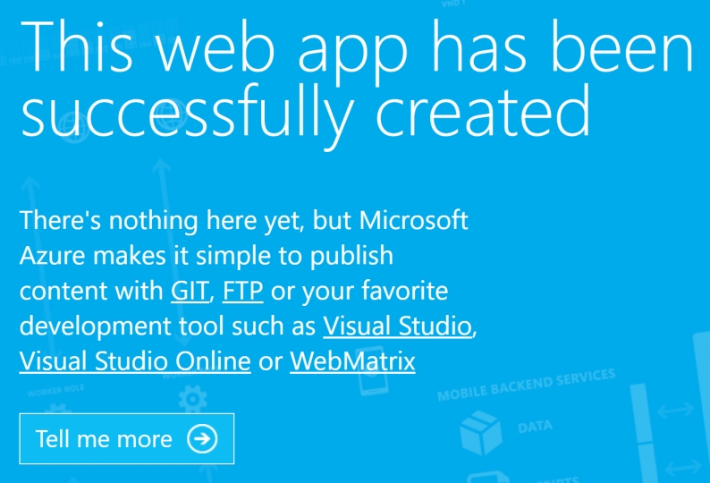

8.  Navigate to the Search tab on the deployed Web App and try searching for chat messages (note that there up to a 5 minute latency before new messages may appear in the search results).
    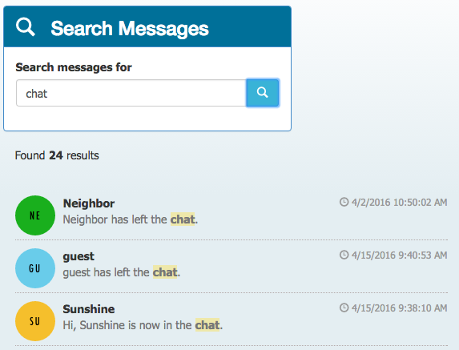
