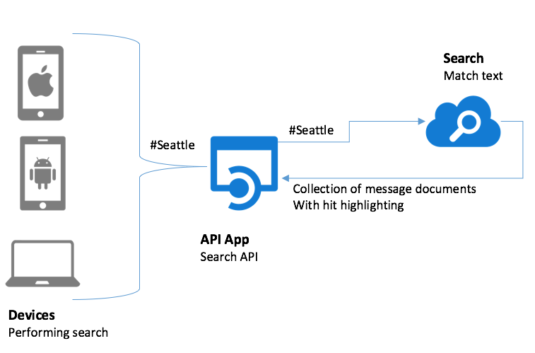

Scenario
========

Adventure Works travel specializes in building software solutions for the hospitality industry. Their latest product is an enterprise mobile/social product called Concierge+. The mobile web app enables guests to easily stay in touch with the concierge and other guests, enabling greater personalization and improving their experience during their stay.

The original requirements for the the product were to support:

-   One-on-one chat sessions between a hotel guest and a hotel concierge

-   A public chat room for hotel guests and hotel staff, called the Hotel Lobby

-   Support for full-text message search, including via \#hashtags and @usernames

Adventure Works wanted to build a solution that was both scalable and extensible. Scalable in the sense that it could support the chat requirements of the largest hotels in the world, currently with as many as 7,200 rooms. While they don’t anticipate having any single chat room with a thousand guests or about 2,000 concurrent one-on-one chats between a guest and the concierge staff, they wanted a solution that could if it needed to. Extensible in the sense that they can add new features on top of the baseline real-time messaging functionality. For example, while today they are starting by supporting search (for their backend) across chat messages, in the future they might want to perform more sophisticated analytics such as sentiment analysis, or the ability to extend it to a mobile app with built-in notifications.

Solution Overview
=================

The solution Adventure Works designed and implemented on Azure leverages Azure App Services (Web Apps and API Apps), Document DB, Azure Search, Event Hubs, Service Bus and Stream Analytics.

Chat Message Flow
-----------------

From a high level, the flow of chat messages from a mobile browser or desktop browser begins with the mobile browser making a Web Sockets connection to a Web App. This Web App acts like a proxy both for receiving messages from the devices and forwarding them on to an Event Hub, as well as for receiving messages on behalf of the connected devices from Service Bus Subscriptions and pushing them down to the appropriate device via the Web Socket connection. A message received from the Web App is stored in an Event Hub. One of the consumers of this Event Hub is a Web Job that is running an instance of EventProcessorHost. The Web Job is responsible for forwarding the message (which consists of both custom message properties and a JSON payload body) from the Event Hub to a Service Bus Topic.

> *NOTE: Why not use Stream Analytics for the message forwarding?*
>
> The reason EventProcessorHost was used here, and not say Stream Analytics is that currently Stream Analytics does not process nor forward along message properties—it only works against the message body. The ability to handle message properties is critical to this solution as will be covered shortly.

To receive a message, a client device connects via a Web Socket to a Web App and waits for the Web App to push messages to it. The Web App, in turn creates a Subscription on the Service Bus Topic for each connected device session, that effectively listens for messages that are intended for the device session. When the Web App gets a message, it pushes it down to the appropriate device. In this topology, all chat messages are sent thru the Event Hub and are consumed from a Subscription.

> *NOTE: Why not just send messages directly to Service Bus Topic?*
>
> The choice to always send chat messages through Event Hub was made to satisfy the extensibility and scalability requirements. By using Event Hub, the ingest of chat messages can scale to tremendous volumes, whilst also allowing new downstream consumer applications to be added as needed, without affecting Service Bus Topic and Subscription limits (e.g., number of concurrent connections/subscriptions and throughput) when performing internal message routing.

### Chat Sessions

The main concept that enable the bi-directional chat is the definition of a chat session. In general a chat session can be one-to-one (such as the concierge and hotel guest) or many-to-many (such as the hotel lobby chat room). In Service Bus, the minimal configuration of this maps to each session consisting of two or more Subscriptions against one Topic for the whole hotel:

-   A one-on-one chat consists of two Subscriptions (one for each user in the chat), each subscription with a SQL Filter where the filter examines the message property “SessionID”.

-   A public chat is many Subscriptions (one for each user in the chat) with a SQL Filter with a SQL Filter where the filter examines the message property “SessionID”.

In either case, the “connection” is made when messages are sent that have the same value for the SessionID property because the message will be picked up by the Subscriptions that are listening for messages with that SessionID and ultimately delivered to related client device. In this guide, we focus on the public chat scenario.

Chat Message Search Flow
------------------------

In order to support the requirements of searchable messaging and long term extensibility, all chat messages flow thru Event Hubs (which gives the solution the ability to “plug in” new forms of downstream message processing) and are stored in Document DB.

> *NOTE: Why store messages in DocumentDB?*
>
> DocumentDB was selected as the message store for a few reasons. First, in the future it possible scale out by adding additional collections. Second, the message format is JSON and Document DB makes it easy to query JSON. Third, both Azure Search and Stream Analytics provided first class integration with DocumentDB for indexing messages and inserting messages respectively.

To support the searching of messages, an Azure Search Index is created that is populated every five minutes by an Azure Search Indexer that pulls from Document DB.

Once a message is indexed within Azure Search, it properties (such as the username of the user who sent) and its message text become full-text searchable. To perform a search, the browser which loads the search web page on the device makes cross-origin, XmlHttpRequest to an API App that wraps requests to the Azure Search API, as illustrated by the following:

The messages matching the search are returned, with HTML and CSS formatting embedded so that the particular text that matches the search query is emphasized upon results display.

Implementation Highlights
=========================

In this section we highlight some the key implementation details that are insightful for building similar solutions on Azure.

Event Processing
----------------

To accomplish the processing of messages pulled from Event Hub, we needed a solution that could scale out to multiple instances, so that no one instance could be overwhelmed and prevent chat from happening. To accomplish this, we use the EventProcessorHost class which is provided as a part of the Service Bus SDK’s. The EventProcessorHost give use a client that can reliably pull from multiple partitions within an Event Hub, where it periodically checkpoints to Azure Storage it progresses through particular partition. In addition, it is capable of managing concurrent access to partitions, so that at no point in time are multiple processes consuming from a single partition. If a new instance running the EventProcessorHost is spun up, it gracefully deals with distributing partitions to the newly available resource, while ensuring that all partitions are being processed and no partition has more than one consumer.

The easiest way to to understand the EventProcessorHost is to examine how it coded within the ChatMessageSentimentProcessor project.

The SentimentventProcessor class (located in SentimentEventProcessor.cs) is where we put the logic we want run anytime messages are retrieved from the Event Hub. This class provides an implementation of the IEventProcessor interface, which defines three async methods: OpenAsync (to perform any custom initialization before messages are retrieved from a particular Event Hub partition), ProcessEventsAsync (called when there is a new batch of messages to be processed from a single Event Hub partition), and CloseAsync (called when we are shutting down the processing on a particular Event Hub partition).

In our implementation of OpenAsync, we log the partition to which we are connecting and then open up an instance of the Service Bus TopicClient we will use to forward messages from the Event Hub to the Topic. We also creat an instance of EventHubClient that we use to forward messages to for archival purposes by Stream Analytics. Additionally, we kickoff an instance of the StopWatch, which we use to periodically checkpoint our progress thru the Event Hubs instance messages.

Task IEventProcessor.OpenAsync(PartitionContext context)

{

this.checkpointStopWatch = new Stopwatch();

this.checkpointStopWatch.Start();

this.\_topicClient = TopicClient.CreateFromConnectionString(
\_connectionString, \_chatTopicPath);

this.\_eventHubClient = EventHubClient.CreateFromConnectionString(

\_connectionString, \_destinationEventHubName);

return Task.FromResult&lt;object&gt;(null);

}

In ProcessEventsAsync, we are provided an IEnumerable of EventData instances which contain the chat messages, in the form of EventData instances, that we are reading from the Event Hub partition. We iterate through this collection. For each message, we extract the binary payload from the EventData instance and the call GetSentimentScore (which wraps the call to the Text Analytics REST API). The resulting model, inclusive of sentiment score is packaged in a BrokeredMessage instance and then forwarded to the Service Bus Topic using TopicClient, for consumption by the web chat clients. Similarly, the binary serialized model is packaged in a new EventData instance and forwarded to the next Event Hubs instances for archival by Stream Analytics into Document DB.

async Task IEventProcessor.ProcessEventsAsync(PartitionContext context, IEnumerable&lt;EventData&gt; messages)

{

foreach (var eventData in messages)

{

try

{

var eventBytes = eventData.GetBytes();

var jsonMessage = Encoding.UTF8.GetString(eventBytes);

var msgObj = JsonConvert.DeserializeObject&lt;MessageType&gt;(jsonMessage);

msgObj.score = await GetSentimentScore(msgObj.message);

var updatedEventBytes = Encoding.UTF8.GetBytes(JsonConvert.SerializeObject(msgObj));

//Send to topic

BrokeredMessage chatMessage = new BrokeredMessage(updatedEventBytes);

EventData updatedEventData = new EventData(updatedEventBytes);

foreach (var prop in eventData.Properties)

{

chatMessage.Properties.Add(prop.Key, prop.Value);

updatedEventData.Properties.Add(prop.Key, prop.Value);

}

\_topicClient.Send(chatMessage);

//Send to next EventHub

\_eventHubClient.Send(updatedEventData);

}

catch (Exception ex)

{

LogError(ex.Message);

}

}

}

The implementation of GetSentimentScore is supported by a few internal classes which represent the payload sent (which is an array of documents to score, each having an id and body text), as well as methods that use the HttpClient to post the chat message text to the provisioned Cognitive Services API endpoint (passing the authentication token in the Ocp-Apim-Subscription-Key request headers).

class SentimentRequest

{

public SentimentDocument\[\] documents;

}

class SentimentDocument

{

public string id;

public string text;

}

private async Task&lt;double&gt; GetSentimentScore(string messageText)

{

double sentimentScore = -1;

using (var client = new HttpClient())

{

client.BaseAddress = new Uri(\_textAnalyticsBaseUrl);

client.DefaultRequestHeaders.Add("Ocp-Apim-Subscription-Key",
\_textAnalyticsAccountKey);

> client.DefaultRequestHeaders.Accept.Add(
> new MediaTypeWithQualityHeaderValue("application/json"));

var req = new SentimentRequest()

{

documents = new SentimentDocument\[\]

{

new SentimentDocument() { id = "1", text = messageText }

}

};

var jsonReq = JsonConvert.SerializeObject(req);

byte\[\] byteData = Encoding.UTF8.GetBytes(jsonReq);

// Detect sentiment

string uri = "sentiment";

var response = await CallEndpoint(client, uri, byteData);

var result = JsonConvert.DeserializeObject&lt;SentimentResponse&gt;(response);

sentimentScore = result.documents\[0\].score;

}

return sentimentScore;

}

static async Task&lt;String&gt; CallEndpoint(HttpClient client, string uri, byte\[\] byteData)

{

using (var content = new ByteArrayContent(byteData))

{

content.Headers.ContentType = new MediaTypeHeaderValue("application/json");

var response = await client.PostAsync(uri, content);

return await response.Content.ReadAsStringAsync();

}

}

In the CloseAsync, we log the event and make sure to make one last checkpoint to capture our latest progress before shutting down the processing on the Event Hub partition.

async Task IEventProcessor.CloseAsync(PartitionContext context, CloseReason reason)

{

if (reason == CloseReason.Shutdown)

{

await context.CheckpointAsync();

}

}

With a grasp of how the EventProcessorHost works, the approach we take to hosting in a Web Job is straightforward. There are basically two options: we could host the an executable (so our Web Job would basically be managing the lifetime of command line executable) or we use the latest Web Job SDK’s that provide first class, programmatic support for EventProcessorHost. We chose the latter option. If you look at the ChatSentimentMessageProcessor project (which started off as a plain vanilla Web Job project) and open Program.cs and look at Main(), this is what you will see. The key is that we register the use of Event Hubs with Web Job’s JobHostConfiguration instance and use it when initializing the JobHost.

EventProcessorHost eventProcessorHost = new EventProcessorHost(eventProcessorHostName, eventHubName, EventHubConsumerGroup.DefaultGroupName, eventHubConnectionString, storageConnectionString);

eventHubConfig.AddEventProcessorHost(eventHubName, eventProcessorHost);

JobHostConfiguration config = new JobHostConfiguration(storageConnectionString);

config.UseEventHub(eventHubConfig);

JobHost host = new JobHost(config);

var options = new EventProcessorOptions();

options.ExceptionReceived += (sender, e) =&gt;

{

Console.ForegroundColor = ConsoleColor.Red;

Console.WriteLine(e.Exception);

Console.ResetColor();

};

eventProcessorHost.RegisterEventProcessorAsync&lt;SentimentEventProcessor&gt;(options);

// The following code ensures that the WebJob will be running continuously

host.RunAndBlock();

eventProcessorHost.UnregisterEventProcessorAsync().Wait();

Web Based Chat Client
---------------------

Now that we have examined how messages are moved internally, let’s look at how the clients send and receive chat messages. The client is in effect a web page. This web page maintains bidirectional communication with the Web App using a Web Socket. Each Web Socket instance manages the state of the chat in which the client is involved (including its connection with Service Bus). The crux of this is implemented in the MyWebSocket class (MyWebSocket.cs), which uses the WebSocketConnection class from the Owin.WebSocket NuGet package. An instance of this class is created for every Web Socket connection established. Messages are sent back over the Web Socket to the web page client. For example, when a message is received, the brokered message is sent to the client via the Web Socket by using the WebSocketConnection.SendText method and then the method is completed (so that the message is deleted from the Service Bus Subscription).

void ReceiveChatMessage(BrokeredMessage message)

{

try

{

SendText(message.GetBody&lt;byte\[\]&gt;(), true);

message.Complete();

}

catch (Exception ex)

{

//TODO: handle errors

}

}

A message is sent as follows:

private void SendChatMessage(string chatText, string sessionId)

{

var message = new

{

message = chatText,

createDate = DateTime.UtcNow,

username = username,

sessionId = sessionId,

messageId = Guid.NewGuid().ToString()

};

try

{

// Use an Event Hub sender, message includes session ID as a Property

string jsonMessage = JsonConvert.SerializeObject(message);

EventData eventData = new EventData(Encoding.UTF8.GetBytes(jsonMessage));

eventData.Properties.Add("SessionId", sessionId);

eventHubClient.Send(eventData);

}

catch (Exception ex)

{

//TODO: Enable logging

}

}

When the Web Socket connection is disconnected (e.g., because the user closes the browser or navigates to another web page), we also cleanup the connection to the Service Bus resources. We do this by overriding the OnClose method, which disconnects as previously shown.

public override void OnClose(WebSocketCloseStatus? closeStatus, string closeStatusDescription){

DisconnectFromChatSession(sessionId);

}

From the Web Page perspective, the chat is largely handled by Scripts\\chatClient.js which modifies the DOM in response to the Web Socket events.

Chat Search
-----------

The Chat Search is implemented in Controllers\\SearchController.cs of the ChatAPI project. This controller implements one method, Get, that takes as input the search string (from the query string), it then invokes Azure Search and return the results prepared for consumption by the web page. One notable step is that it merges the hit highlighted search results with the regular search results so that the web page only has one result set to deal with.

public string Get(string searchText)

{

// Perform search

SearchIndexClient searchIndexClient = new SearchIndexClient(searchServiceName, indexName, new SearchCredentials(queryApiKey));

SearchParameters sp = new SearchParameters()

{

HighlightFields = new List&lt;string&gt;() { "message" },

HighlightPreTag = "&lt;span class='hit'&gt;",

HighlightPostTag = "&lt;/span&gt;"

};

var result = searchIndexClient.Documents.Search&lt;ChatMessage&gt;(searchText, sp);

List&lt;ChatMessage&gt; matchedMessages = new List&lt;ChatMessage&gt;();

foreach (var searchResult in result.Results)

{

// Replace the message with the hit highlighted version

searchResult.Document.Message = searchResult.Highlights\["message"\].First();

matchedMessages.Add(searchResult.Document);

}

string jsonResult = JsonConvert.SerializeObject(matchedMessages);

return jsonResult;

}

This method is invoked from the web page hosted by the Web App. Within the ChatWebApp project, this web page exists in Views\\Home\\Search.cshtml, and the logic is expressed in Scripts\\searchClient.js. The latter contains the following script.

$(document).ready(function () {

$("\#btnSendSearch").click(function () {

var searchText = encodeURIComponent($("\#searchText").val());

doSearch(searchText);

});

$("\#searchText").on("keyup", function (event) {

if (event.keyCode == 13) {

$("\#btnSendSearch").click();

}

});

function doSearch(searchText) {

$.getJSON(chatSearchApiBase + "/api/search?searchText=" + searchText, function (data) {

var items = \[\], searchResultsDiv = $("div.search-results");

var searchResults = JSON.parse(data);

if (searchResults && searchResults.length &gt; 0) {

com.contoso.concierge.findUniqueSearchUsers(searchResults);

$.each(searchResults, function (key, searchResult) {

items.push(createChatEntry(searchResult));

});

$("div.search-empty").hide();

searchResultsDiv.empty();

searchResultsDiv.html("&lt;p&gt;Found &lt;strong&gt;" + searchResults.length + "&lt;/strong&gt; " + (searchResults.length === 1 ? "result" : "results") + "&lt;/p&gt;&lt;p&gt;&nbsp;&lt;/p&gt;")

$("&lt;ul/&gt;", {

"class": "chat",

html: items.join("")

}).appendTo("div.search-results");

}

else {

searchResultsDiv.empty();

$("div.search-empty").show();

}

});

}

function createChatEntry(searchResult) {

var chatEntry = "", createDate, initial;

createDate = new Date(searchResult.CreateDate);

initial = searchResult.Username.substring(0, searchResult.Username.length &gt; 1 ? 2 : 1).toUpperCase();

chatEntry = '&lt;li class="chatBubbleOtherUser left clearfix"&gt;&lt;span class="chat-img pull-left"&gt;';

chatEntry += '&lt;img src="http://placehold.it/50/' + com.contoso.concierge.getAvatarColor(searchResult.Username) + '/fff&text=' + initial + '" alt="' + searchResult.Username + '" class="img-circle" /&gt;&lt;/span&gt;';

chatEntry += '&lt;div class="chat-body clearfix"&gt;&lt;div class="header"&gt;';

chatEntry += '&lt;strong class="primary-font"&gt;' + searchResult.Username + '&lt;/strong&gt;&lt;small class="pull-right search-time text-muted"&gt;';

chatEntry += '&lt;span class="glyphicon glyphicon-time"&gt;&lt;/span&gt;&nbsp;' + createDate.toLocaleDateString() + ' ' + createDate.toLocaleTimeString() + '&lt;/small&gt;&lt;/div&gt;';

chatEntry += '&lt;p&gt;' + searchResult.Message + '&lt;/p&gt;';

chatEntry += '&lt;/div&gt;&lt;/li&gt;';

return chatEntry;

}

});

One key observation is to note that the searchText pulled from the input field has to be encoded using encodeURIComponent before sending it to the API so it doesn’t get confused as being part of the request URL (e.g., so that \# characters are not ignored).
